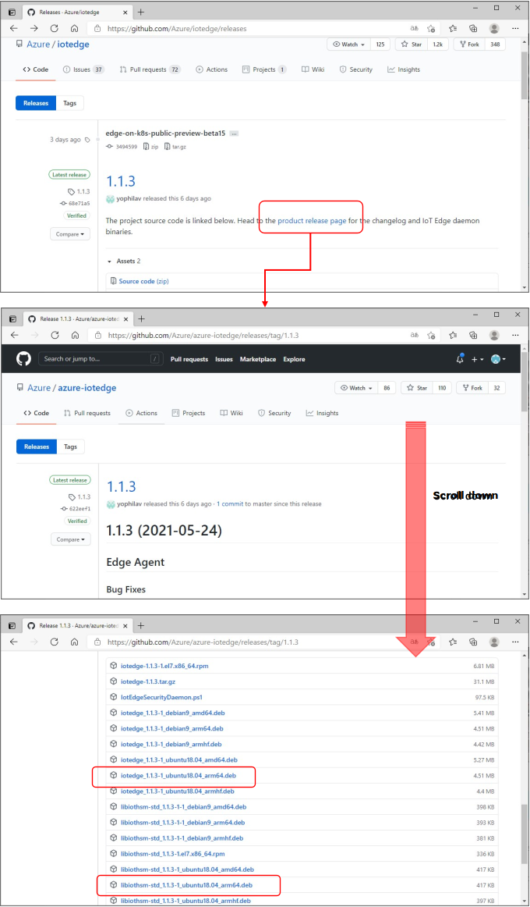

# How to Install IoT Edge on Jetson Nano
[Azure IoT Edge 1.1.x](https://docs.microsoft.com/ja-jp/azure/iot-edge/?view=iotedge-2018-06) を [Jetson Nano](https://developer.nvidia.com/embedded/jetson-developer-kits) にインストールする方法を説明する。  
手順は以下の通り。  
1. Jetson Nano のセットアップ
2. Jetson Nano の OS バージョン確認  
3. Azure IoT Edge Runtime のインストール  
4. Azure IoT Edge Runtime の Cloud への接続とセットアップ  

---
## 1. Jetson Nano のセットアップ  
[Getting Started with Jetson Nano Developer Kit](https://developer.nvidia.com/embedded/learn/get-started-jetson-nano-devkit) を参考に、HW のセットアップ、OSのインストールを行う。  
- マイクロSDカードは、32GB 以上を推奨  
- Install の際、HDMI Display、USB マウス、USB キーボード が必要  
- 5V 電源供給は、PC と Jetson Nano ボードを USB 接続すれば可能だが、5V、2A以上の外径5.5、内径2.1のスイッチングACアダプターを使うと便利  

OS のセットアップが一通り終わったら、Jetson Nano のデスクトップでの作業が必要ない場合は、PC からネット越しに SSH 接続して作業するのが便利。特に、Azure IoT Edge のインストール・セットアップ・運用は、シェル上でのコマンドライン実行で十分なので、Tera Term や Putty 等を使ってリモート接続して作業をすることをお勧めする。  

Step 3. で使用する、curl コマンドをインストールする。  
```sh
sudo apt-get udpate
sudo apt-get install curl
```

---
## 2. Jetson Nano の OS バージョン確認
インストール済みの OS(Ubuntu) のバージョンを確認する。  
シェル上で以下のコマンドを実行する。  
```sh
cat /etc/os-release
```
NAME="Ubuntu"  
VERSION="18.04.5 LTS (Bionic Beaver)"  
ID=ubuntu  
ID_LIKE=debian
PRETTY_NAME="Ubuntu 18.04.5 LTS"  
VERSION_ID="<U><B>18.04</B></U>"  
HOME_URL="https://www.ubuntu.com/"  
SUPPORT_URL="https://help.ubuntu.com/"  
BUG_REPORT_URL="https://bugs.launchpad.net/ubuntu/"  
PRIVACY_POLICY_URL="https://www.ubuntu.com/legal/terms-and-policies/privacy-policy"  
VERSION_CODENAME=bionic  
UBUNTU_CODENAME=bionic

この表示で、Ubuntu 18.04(2021/5/31現在)であることが判る。  
NVIDIA が提供する OS Image には、Docker Engine が同梱されていて、OS のセットアップが終わると、Docker が起動状態になっている。この Docker をそのまま、Azure IoT Edge Runtime 実行用に使用する。  
以下のコマンドで実行中の Docker のバージョンを表示できる。  
```sh
sudo docker version
```

---
## 3. Azure IoT Edge Runtime のインストール  
前のステップで、OS のバージョンが判明したので、それを元に、インストールする Azure IoT Edge Runtime のライブラリを確定する。  
[Azure IoT Edge のリリースページ](https://github.com/Azure/iotedge/releases) をブラウザで開き、Ver 1.1 系の最新リリースを探す。  
2021/5/31 現在、1.1.3 が最新リリースなので、その"[product release page](https://github.com/Azure/azure-iotedge/releases/tag/1.2.0)"をクリックする。  
表示されたページをスクロールダウンし、Assetsの項目を表示し、対応するライブラリを探す。  
  
Jetson Nano は、ARM64,Ubuntu 18.04 なので赤枠で囲んだ二つのライブラリを利用する。  
それぞれの項目を右クリックし、URL を取得する。  
  
2021/5/31 現在の最新の URL は、以下の通りとなる。  
|Library Name|URL|
|-|-|
|iotedge|https://github.com/Azure/azure-iotedge/releases/download/1.1.3/iotedge_1.1.3-1_ubuntu18.04_arm64.deb|
|libiothsm-std|https://github.com/Azure/azure-iotedge/releases/download/1.1.3/libiothsm-std_1.1.3-1_ubuntu18.04_arm64.deb|  

※ AMD64、ARMhf など間違いやすい ARCH があるので、注意。  
この二つのライブラリを Jetson Nano 上にダウンロードする。  
```sh
mkdir iotedge-runtime
cd iotedge-runtime
curl -L https://github.com/Azure/azure-iotedge/releases/download/1.1.3/iotedge_1.1.3-1_ubuntu18.04_arm64.deb -o  iotedge.deb
curl -L https://github.com/Azure/azure-iotedge/releases/download/1.1.3/libiothsm-std_1.1.3-1_ubuntu18.04_arm64.deb -o libiothsm-std.deb
```
結果を一応確認しておく。  

nvidia@nvidia-desktop:~/iotedge-runtime$ ls -la  
total 5048  
drwxrwxr-x  2 nvidia nvidia    4096  5月 31 10:41 .  
drwxr-xr-x 18 nvidia nvidia    4096  5月 31 10:06 ..  
-rw-rw-r--  1 nvidia nvidia 4726928  5月 31 10:41 iotedge.deb  
-rw-rw-r--  1 nvidia nvidia  426872  5月 31 10:41 libiothsm-std.deb  
n
ダウンロードしたライブラリを、libiothsm-std、iotedge の順にインストールする。  
```sh
sudo dpkg -i ./libiothsm-std.deb
sudo dpkg -i ./iotedge.deb
```

念のため、インストール成功を以下のコマンドで確認する。  
```sh
nvidia@nvidia-desktop:~/iotedge-runtime$ sudo iotedge version
iotedge 1.1.3
```

---
## Step 4. Azure IoT Edge Runtime の Cloud への接続とセットアップ  
Azure IoT Edge をクラウドに接続するための Azure IoT Hub を、"[Azure Portal を使用して IoT Hub を作成する](https://docs.microsoft.com/ja-jp/azure/iot-hub/iot-hub-create-through-portal)" に従って作成する。  
既に、Azure IoT Hub を作成済みの場合は、それを流用してもよい。  

Azure IoT Hub に、Jetson Nano を登録する際に使用する名前を決める。  
ここでは、"<b>jetson-nano</b>" として話を進める。  

"[IoT Edge デバイスを IoT Hub に登録する](https://docs.microsoft.com/ja-jp/azure/iot-edge/how-to-register-device?view=iotedge-2018-06&tabs=azure-portal)" を参考に、Jetson Nano 用の登録を行う。  
簡単のため、認証は、<b>対称キー</b> を使うものとして話を進める。  

Azure Portal 上で、Azure IoT Hub インスタンスを選択表示し、左のペインの、"Automatic Device Management" - "IoT Edge" を選択し、以下の図に従って、デバイスを登録する。 
- "Device Id" に "jetson-nano" と入力  
- "Save" をクリック  


"jetson-nano" が登録されたので、Azure IoT Hub に接続するための接続文字列を以下の図に従って取得する。  
- IoT Edge のリストに "jetson-nano" が表示されていたら、それを選択  
- 既に沢山の IoT Edge を登録していて、探すのがめんどくさい時は、クエリー機能で検索  
- "jetson-nano" のページが表示されたら、"Primary Connection String"(Secondary でも可)の右横コピーアイコンをクリックする。  


以下の様な形式の接続文字列が、クリップボードにコピーされる。  

<b>HostName=</b><i>iothubname</i>.azure-devices.net;<b>DeviceId=jetson-nano</b>;<b>SharedAccessKey=</b><i>Base64 encoded Shared Access Key</i>  

<b>Jetson Nano のリモートシェルに戻って</b>、この接続文字列を、/etc/iotedge/config.yaml に設定する。  
```sh
sudo vi /etc/iotedge/config.yaml
```
で、ファイルを開き、120行目付近の  "<b>&lt;ADD DEVICE CONNECTION STRING HERE&gt;</b>"に、Azure Portal で取得した接続文字列をペーストする。  


```yaml
provisioning:
  source: "manual"
  device_connection_string: "HostName=....azure-devices.net;DeviceId=jetson-nano;SharedAccessKey=..."
  dynamic_reprovisioning: false
```
編集が終わったら、ESC、:wq! の順にキーを入力し、保存して vi を終了する。  
新しい設定で動作するように、以下のコマンドで Azure IoT Edge Runtime を再起動する。  
```sh
sudo systemctl restart iotedge
```

念のため、IoT Edge が正常動作しているか、"sudo systemctl status iotedge" コマンドで確認。  
```sh
nvidia@nvidia-desktop:~/iotedge-runtime$ sudo systemctl status iotedge
● iotedge.service - Azure IoT Edge daemon
   Loaded: loaded (/lib/systemd/system/iotedge.service; enabled; vendor preset: enabled)
   Active: active (running) since Mon 2021-05-31 11:24:35 JST; 48s ago
     Docs: man:iotedged(8)
 Main PID: 21920 (iotedged)
    Tasks: 14 (limit: 4181)
   CGroup: /system.slice/iotedge.service
           └─21920 /usr/bin/iotedged -c /etc/iotedge/config.yaml

 5月 31 11:24:57 nvidia-desktop iotedged[21920]: 2021-05-31T02:24:57Z [INFO] - [mgmt] - - - [20
 5月 31 11:24:59 nvidia-desktop iotedged[21920]: 2021-05-31T02:24:59Z [INFO] - [work] - - - [20
 5月 31 11:25:02 nvidia-desktop iotedged[21920]: 2021-05-31T02:25:02Z [INFO] - [mgmt] - - - [20
 5月 31 11:25:11 nvidia-desktop iotedged[21920]: 2021-05-31T02:25:11Z [INFO] - Querying system
 5月 31 11:25:11 nvidia-desktop iotedged[21920]: none
 5月 31 11:25:11 nvidia-desktop iotedged[21920]: 2021-05-31T02:25:11Z [INFO] - Successfully que
 5月 31 11:25:11 nvidia-desktop iotedged[21920]: 2021-05-31T02:25:11Z [INFO] - [mgmt] - - - [20
 5月 31 11:25:11 nvidia-desktop iotedged[21920]: 2021-05-31T02:25:11Z [INFO] - [mgmt] - - - [20
 5月 31 11:25:17 nvidia-desktop iotedged[21920]: 2021-05-31T02:25:17Z [INFO] - [mgmt] - - - [20
 5月 31 11:25:22 nvidia-desktop iotedged[21920]: 2021-05-31T02:25:22Z [INFO] - [mgmt] - - - [20
lines 1-19/19 (END)
```

Azure Portal 側でも、"jetson-nano" が接続されていることを確認可能。  


以上で、Jetson Nano への Azure IoT Edge Runtime のインストール＆セットアップは完了です！

---
## 備考  
### Azure IoT Edge Runtime 1.2 系のインストールについて  
2021/6/5 現在、1.2系の最新バージョンは、1.2.0 である。このバージョンの Ubuntu 18.04、ARM64 向けのライブラリをインストールする。  
Github のリリースページから該当するライブラリの URL をダウンロードする。  
```sh
curl -L https://github.com/Azure/azure-iotedge/releases/download/1.2.1/aziot-identity-service_1.2.0-1_ubuntu18.04_arm64.deb -o aziot-identity-service.deb
curl -L https://github.com/Azure/azure-iotedge/releases/download/1.2.1/aziot-edge_1.2.1-1_ubuntu18.04_arm64.deb -o aziot-edge.deb
```
ダウンロードしたライブラリをインストールする。  
```sh
sudo dpkg -i ./aziot-identity-service.deb
sudo dpkg -i ./aziot-edge.deb
```
SAS Token による接続セキュリティを、/etc/aziot/config.toml に書き込む。  
```toml
[sudo] password for nvidia:
auto_reprovisioning_mode = "OnErrorOnly"
imported_master_encryption_key = "/var/lib/iotedge/hsm/enc_keys/edgelet-masterWt5mT2xpO72EPKlt2Tt0Sq4uJCrMvfl2rzzKRB3pnyo_.enc.key"
hostname = "nvidia-desktop"

[provisioning]
source = "manual"
iothub_hostname = "<Iot Hub name>.azure-devices.net"
device_id = "jetson-nano"

[provisioning.authentication]
method = "sas"

[provisioning.authentication.device_id_pk]
value = "<SAS Token>"

[aziot_keys]
```
ファイル内の
- <b><i><u>&lt;IoT Hub name&gt;</u></i></b> を、jetson-nano を登録した、Azure IoT Hub の名前で置き換える  
- <b><i><u>&lt;SAS Token&gt;</u></i></b> を、jetson-nano のプライマリ、または、セカンダリーの SAS Token で置き換える  

で、編集 ＆ 保存し、次のコマンドを実行して、Azure IoT Edge Runtime を再起動する。  
```sh
sudo iotedge system restart
```

以上で、 1.2系のインストールは完了。  

ライブラリーをダウンロードする際、正しいものを選択すること。違う OS、違う CPU Architecture のものをインストールしてしまうと、依存ライブラリーとの不整合などを起こし、IoT Edge Runtime の起動が失敗する。  
※ 筆者は実際間違ってしまい、このページの一つ前のバージョンの最後に記載したような目に合ってしまったw

## config ファイルの更新  
Azure IoT Hub で新しく登録した IoT Edge へのつなぎ変えや、セキュリティ情報の更新などを行う場合は、1.1系と 1.2系で設定ファイルや更新コマンドが異なるので留意すること。  
|Version|設定ファイル|設定更新反映コマンド|
|-|-|-|
|1.1系|/etc/iotedge/config.yaml|sudo systemctl restart iotedge|
|1.2系|/etc/aziot/config.toml|sudo iotedge config apply|
