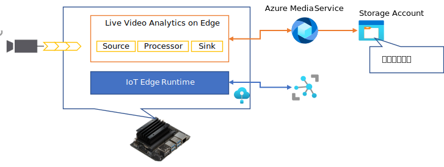
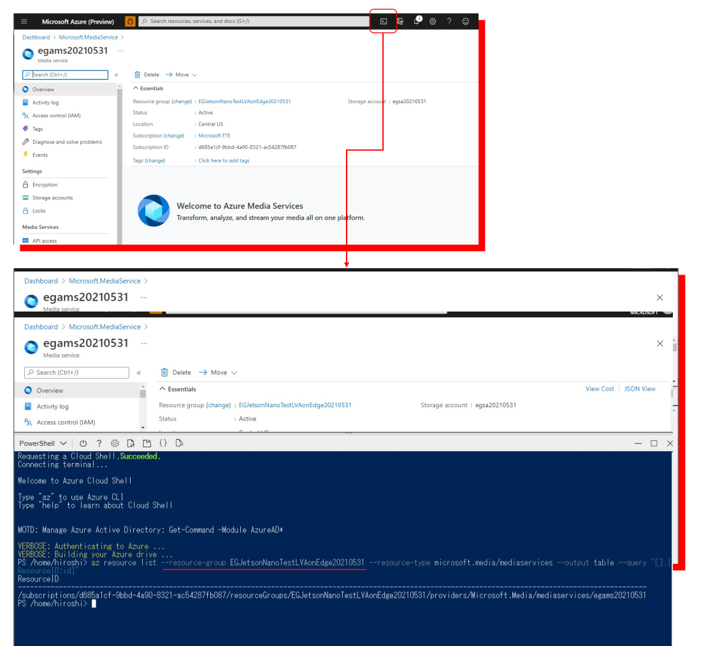
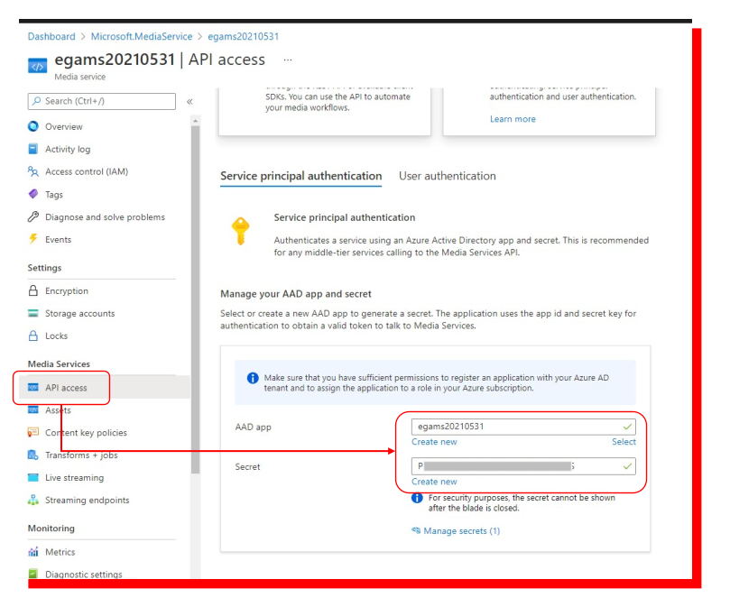
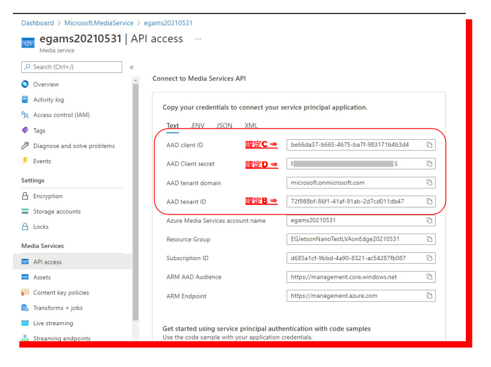
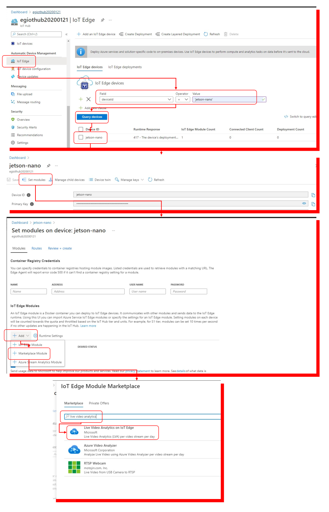
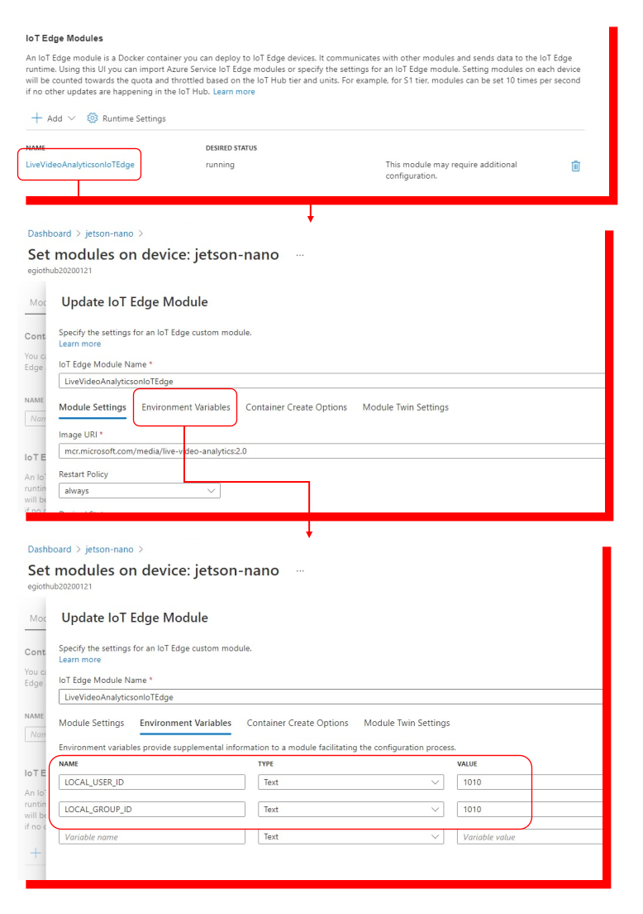
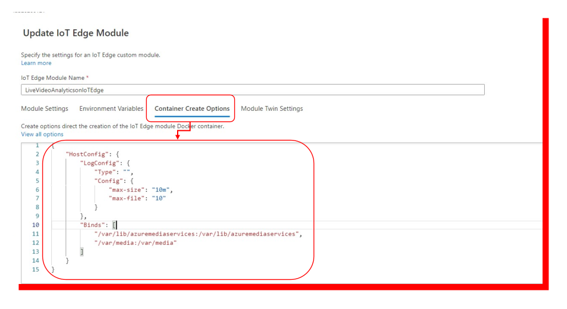
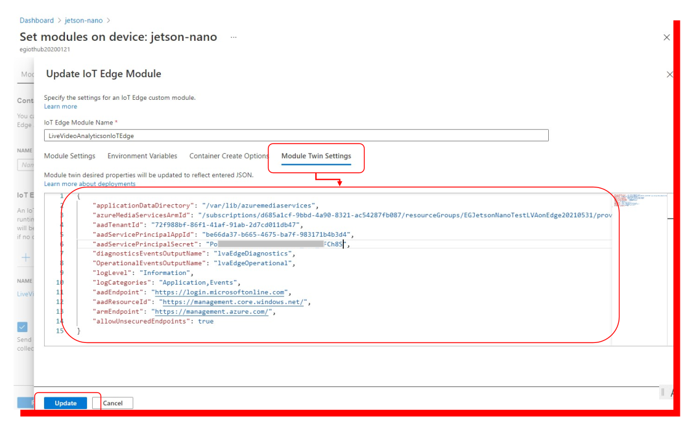
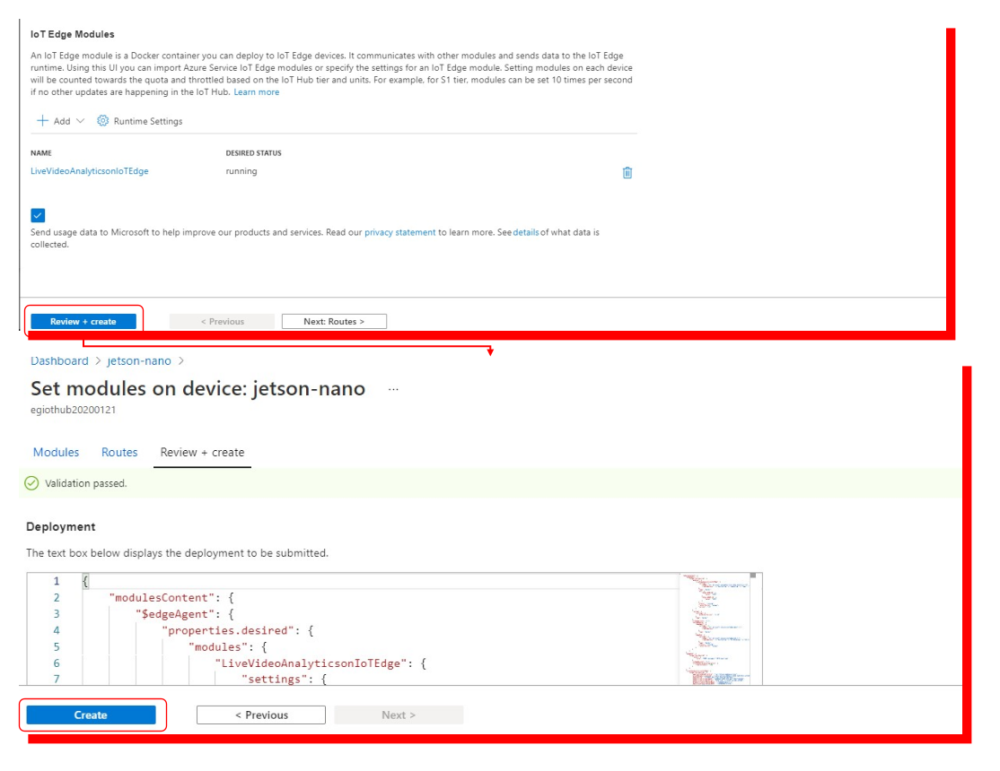
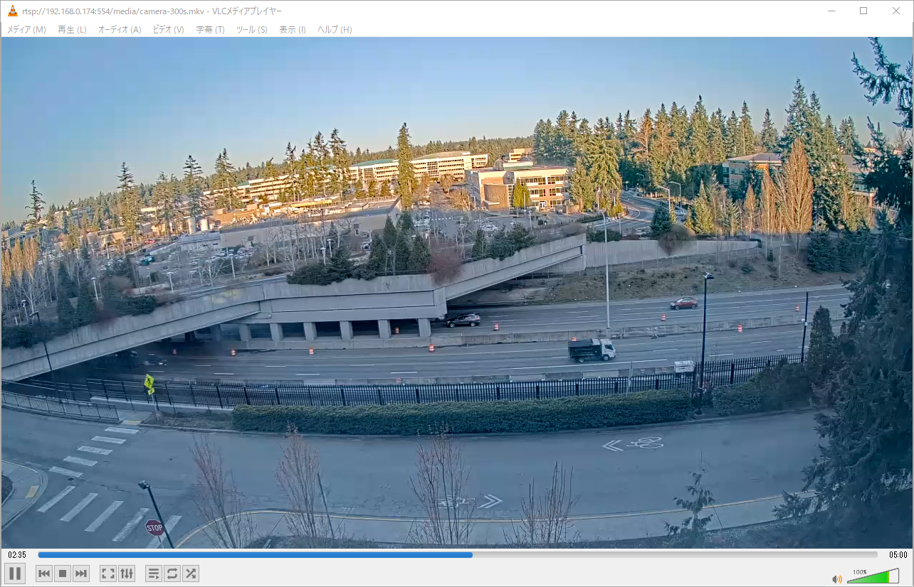

# How to install Live Video Analytics on Edge  
LVA on Edge を実機上で動かす方法が、Microsoft Doc の方々に散らばっているので、このページで Step by Step にまとめる。  
Live Video Analytics on Edge の詳細については、  
- "[Live Video Analytics on IoT Edge とは](https://docs.microsoft.com/ja-jp/azure/media-services/live-video-analytics-edge/overview)"
- "[チュートリアル：ビデオ分析 - 物体とモーションの検出アプリケーション手プレートを使用して IoT Central アプリケーションをデプロイする方法](https://docs.microsoft.com/ja-jp/azure/iot-central/retail/tutorial-video-analytics-deploy)"　　
- "[IoT ALGYAN オンラインセミナー LVA on Edge Deep Dive](https://youtu.be/-ed8S4jgcUM)"  
あたりで学んでほしい。  

Step by Step set up  
Live Video Analytics on Edge は図の様な技術・サービス群で構成される。  
  
この構成を念頭に、作業を進めること。  

1. Jetson Nano の設定
1. Azure Media Service の作成とアクセス権設定  
1. Live Video Analytics on Edge Module の配置指定  
1. 動画ストリームの起動  
1. LVA on Edge の、グラフトポロジー設定・起動  

## 1. Jetson Nano の設定 
まず、LVA on Edge module が動作するための、ユーザー、グループ、作業ディレクトリを準備する。  
※ 参考ドキュメント - "[IoT Edge デバイスに Azure Live Video Analytics をデプロイする](https://docs.microsoft.com/ja-jp/azure/media-services/live-video-analytics-edge/deploy-iot-edge-device)"  


Jetson Nano の シェル上で以下のコマンドを実行し、LVA on Edge Module デプロイ用のローカルユーザーアカウントの作成  
```sh
sudo groupadd -g 1010 localusergroup
sudo useradd --home-dir /home/edgeuser --uid 1010 --gid 1010 lvaedgeuser
```

LVA on Edge Module が動作するための構成データを格納するローカルフォルダーを作成する。  
```sh
sudo mkdir -p /var/media
sudo chown -R lvaedgeuser /var/media
```

動画ストリームをシミュレーションするために、https://github.com/azure/live-video-analytics を Jetson Nano 上に clone する。  

```sh
 git clone https://github.com/Azure/live-video-analytics.git
```

clone したディレクトリの live-video-analytics/media にある、Readme.md に多くの動画の URL が記載されているので、いくつかダウンロードする。  
例えば、  
```sh
cd live-video-analytics/media
curl -L https://lvamedia.blob.core.windows.net/public/camera-300s.mkv -o camera-300s.mkv
curl -L https://lvamedia.blob.core.windows.net/public/lots_284.mkv -o lots_284.mkv
```  
等々をダウンロードし、/var/media にコピーする。  
```sh
sudo cp *.mkv /var/media
```

---  
## 2. Azure Media Service の作成とアクセス権設定  
Jetson Nano にインストールされた Azure IoT Edge 上で動く LVA on Edge は、クラウド上の Azure Media Service と連動して動作するので、Azure Media Service を作成し、作成したインスタンスにアクセス可能な権限を設定しなければならない。  
作成方法は、"[Azure Media Services をデプロイして構成する](https://docs.microsoft.com/ja-jp/azure/iot-central/retail/tutorial-video-analytics-create-app-yolo-v3#deploy-and-configure-azure-media-services)" を参考に行う。  
※ 説明で、Azure Portal 上での作業と、Azure CLI による Powershell 上の作業が混在して判り難いが、よーく読んで確実に全て作業を行うのがポイント。  

Live Video Analytics on Edge の設定には以下の設定群が必要となる。数も多く紛らわしいので、ここで一覧を記載しておく。それぞれの項目にラベリングして、以下の説明で、対応する場合は明記するので参考にしてほしい。  

- 設定A - azureMediaServiceArmId  
- 設定B - aadTenantId  
- 設定C - aadServicePrincipalAppId  
- 設定D - aadServicePrincipalSecret

Azure Media Service を作成する中で、Storage Account も一緒に作成（もしくは既存のものを選択）する。  
Azure Media Service の作成が完了したら、そのページを開き、Cloud Shell を起動して、作業をすると効率が良い。  

※ --resource-group オプションのリソース名を間違えないこと。  
表示された、ResourceId をメモ等にコピーしておく。  
この作業で表示された文字列が、<b>設定A</b> として使われる。  

次に、Azure Portal で、Azure Media Service の左側の、[APIアクセス]→[サービスプリンシパルの認証] を選択し、作成した、Azure Media Service と同じ名前で新しい Active Directory アプリを作成し、"IoT Edge Access" という説明でシークレットを作成する。  

AAD App の "Create new" をクリックして、作成した Azure Media Service の名前で App を作成し、次に、Secret の "Create new" をクリックして作成する。  
作成したら、同じページの下の方にスクロールダウンして、表示されている設定群を、メモ等にコピペしておく。  

※ Secret はこのページを閉じてしまうと、二度と見ること能わずなので、必ずコピーすること。また、期限が来てアクセス権がなくなったら新しく権限を作成すること。  

---
## 3. Live Video Analytics on Edge Module の配置指定  
次の設定の場は、Azure Portal の IoT Hub のページに移る。  
IoT Hub の IoT Edge で jetson-nano を開き、"Set modules" をクリックし、配置指示を開始する。  
"+Add" で、"Market Module" を選択し、検索窓に "Live Video Analytics" と入力し、"Live Video Analytics on IoT Edge" をクリックする。  

"LivVideoAnalyticsonIoTEdge"という名前で追加され、IoT Edge Modules にリスト表示される。表示された項目をクリックして、モジュールの設定に進む。  
"Set modules" をクリックし、まず、環境変数を設定する。  

"Environment Varialbes" をクリックし、以下の二つの環境変数を設定する。 
|環境変数名|値|
|-|-|
|LOCAL_USER_ID|1010|
|LOCAL_GROUP_ID|1010|

次に、コンテナ Create Options の設定を行う。"Container Crate Options" をクリックして、図の下にある JSON で更新する。  

Container Create Options の設定：
```json
{
    "HostConfig": {
        "LogConfig": {
            "Type": "",
            "Config": {
                "max-size": "10m",
                "max-file": "10"
            }
        },
        "Binds": [
            "/var/lib/azuremediaservices:/var/lib/azuremediaservices",
            "/var/media:/var/media"
        ]
    }
}
```
次に、Module Twins の設定を行う。"Module Twins Settings" を選択して、図の下のJSON の設定A～D を前のステップの文字列に変更して、JSON のボックスを書き換える。  

Module Twins の設定：
```json
{
    "applicationDataDirectory": "/var/lib/azuremediaservices",
    "azureMediaServicesArmId": "設定A",
    "aadTenantId": "設定B",
    "aadServicePrincipalAppId": "設定C",
    "aadServicePrincipalSecret": "設定D",
    "diagnosticsEventsOutputName": "lvaEdgeDiagnostics",
    "OperationalEventsOutputName": "lvaEdgeOperational",
    "logLevel": "Information",
    "logCategories": "Application,Events",
    "aadEndpoint": "https://login.microsoftonline.com",
    "aadResourceId": "https://management.core.windows.net/",
    "armEndpoint": "https://management.azure.com/",
    "allowUnsecuredEndpoints": true
}
```

以上で環境変数、Container Create Options、Module Twinsの設定が終わったので、"Update" をクリックして設定を確定する。  
後は、左下の、"Review + create" をクリックし、"Create" をクリックして、Jetson Nano への配置指示を発行する。  
  

以上で、Live Video Analytics on Edge モジュールの配置設定が完了する。  
追加で、Jetson Nano のリモートシェルで、配置が完了していることを確認する方法を記載しておく。  

```sh
nvidia@nvidia-desktop:~$ sudo iotedge list  
[sudo] password for nvidia:  
NAME                         STATUS           DESCRIPTION      CONFIG
LiveVideoAnalyticsonIoTEdge  running          Up 31 seconds    mcr.microsoft.com/media/live-video-analytics:2.0
edgeAgent                    running          Up 5 hours       mcr.microsoft.com/azureiotedge-agent:1.1
edgeHub                      running          Up 38 seconds    mcr.microsoft.com/azureiotedge-hub:1.1
```

LiveVideoAnalyticsonIoTEdge の STATUS が running になっていればOK。  

---
## 4. 動画ストリームの起動  
Webcam 等で独自の動画を試してみたいところだが、適当な物体、適当な動くものが表示された動画を用意するのはなかなか難しいので、手順１で説明した、mkv ファイルを元にRTSPによる動画ストリームを作成する方法を紹介し、それを入力する方法も次のステップで説明する。  
最初のステップで clone した github のリポジトリ―に、mkv ファイルをRTSP化するユーティリティが入っている。  
[RTSP SImulator](https://github.com/Azure/live-video-analytics/tree/master/utilities/rtspsim-live555)   
このページに記載された方法で、Docker の build と実行を簡単に行うことができる。  
```sh
 cd utilities/rtspsim-live555/
 sudo docker build . -t live555:latest
 sudo docker run -p 554:554 -i live555:latest
```  
Docker が起動すると、Jetson Nano のローカルネット上のIPアドレスで、/var/media に格納された mks ファイルの RTSPストリームを VLC メディアプレーヤー等で表示ができる。  

```
rtsp://<jetson nano ip address>:554/media/camera-300s.mkv
```


Jetson Nano が接続されたローカルネットにつながっている PC 等からもこのRTSPストリームは特段のネットワークアクセス制限がなければ、参照可能である。  
Live Video Analytics on Edge への入力としても当然使える。  

## 5. LVA on Edge の、グラフトポロジー設定・起動  
基本的な操作方法は、"[モーション検出 - ダイレクトメソッドの呼び出しを使用する](https://docs.microsoft.com/ja-jp/azure/media-services/live-video-analytics-edge/detect-motion-record-video-clips-media-services-quickstart#use-direct-method-calls)"を参考にしていただきたい。  
Live Video Analytics on Edge 向けに、https://github.com/Azure/live-video-analytics/tree/master/MediaGraph/topologies から沢山のサンプルトポロジーが紹介されている。  
例えば、動いているものを検知し、動いているものが写っている間だけ、Azure Media Service を介して動画をクラウド（Storage Account）にアップロードしたい場合は、  
- [Continuous video recording with Motion Detection](https://github.com/Azure/live-video-analytics/tree/master/MediaGraph/topologies/cvr-with-motion)  

が利用可能である。  
参考までに、このページで紹介されているトポロジーの使用手順を紹介する。 モジュールのダイレクトメソッドの使用方法は、前述の Microsoft Docs の説明を参考にしていただきたい。  

### cvr-1. GraphTopologySet のコール  
関数名：  
GraphTopologySet  
Payload：  
https://github.com/Azure/live-video-analytics/blob/master/MediaGraph/topologies/cvr-with-motion/2.0/topology.json をそのままコピー  

このコールで、"CVRWithMotionDetection" という名前でトポロジーが登録される。  

### cvr-2. GraphInstanceSet のコール  
次に、登録したトポロジーを使用するインスタンスを作成する。  
関数名：  
GraphInstanceSet
Payload：  
```json
{
    "@apiVersion" : "2.0",
    "name" : "Motion-Capture",
    "properties" : {
        "topologyName" : "CVRWithMotionDetection",
        "description" : "Continous Video Recording with Motion Detection",
        "parameters" : [
            { "name" : "rtspUrl", "value" : "rtsp://rtspsim:554/media/camera-300s.mkv" }
        ]
    }
}
```
これにより、LVA on Edge の中に、以下のようなグラフインスタンスが作成される。  


### cvr-3. GraphInstanceActivate のコール  
この関数をコールすると、モーション検知が始まる。  
関数名：  
GraphInstanceActivate  
Payload：  
```json
{
    "@apiVersion" : "2.0",
    "name" : "Motion-Capture"
}
```
